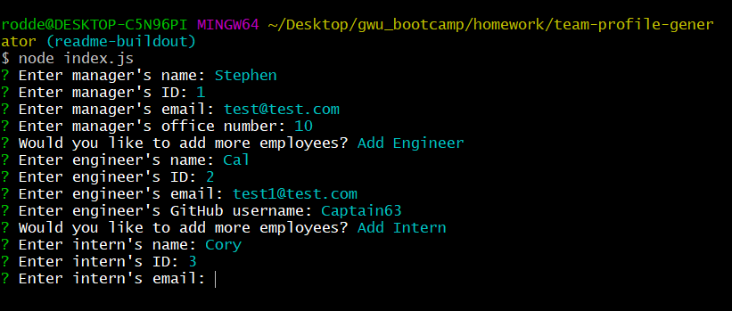
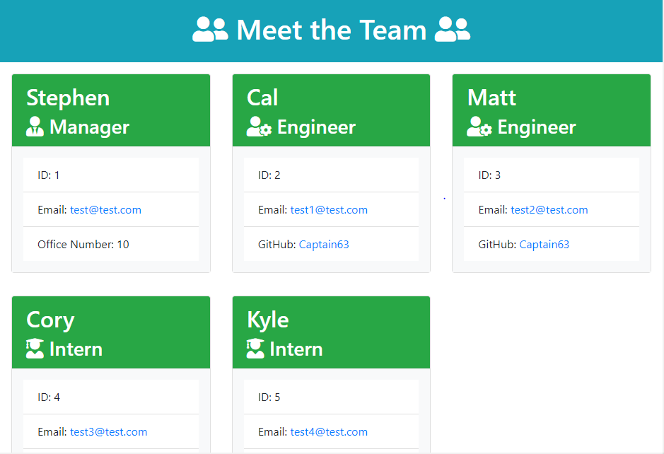

# Team Profile Generator

## Table of Contents
- [Project Overview](#project-overview) 
- [Installation](#installation)
- [Walkthrough](#walkthrough)
- [License](#license)
- [Screenshots](#screenshots)

## Project Overview
Command-line application that generates an HTML file of a work team for easy access to contact and other useful information. Application built using Node.js and leveraging the Inquirer and Jest packages from NPM. Bootstrap and Normalize.css CDNs are linked to style the HTML file without requiring an accompanying stylesheet.

### Languages Used
- JavaScript (Node.js)
- HTML
- CSS

### Libraries Used
- [Inquirer](https://www.npmjs.com/package/inquirer)
- [Jest](https://www.npmjs.com/package/jest)
- [Bootstrap](https://getbootstrap.com/)
- [Font Awesome](https://fontawesome.com/)

## Installation
Node.js is _required_ to use this application. Once cloned/downloaded from GitHub, run command "npm i" in command line to install Inquirer and Jest packages automatically.

## Walkthrough
[View the demonstration video on YouTube](#)

## License
Permission is hereby granted, free of charge, to any person obtaining a copy of this Software and associated documentation files (the "Software"), to deal in the Software without  restriction, including without limitation the rights to use, copy, modify, merge, publish distribute, sublicense, and/or sell copies of the Software, and to permit persons to whom the Software is furnished to do so, subject to the following conditions.

[View the full license](./LICENSE).

## Screenshots

